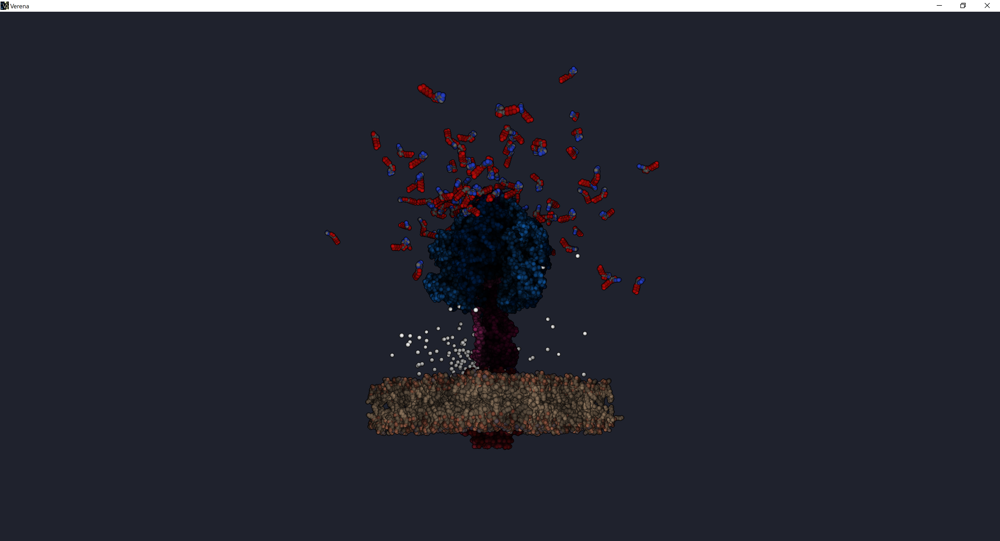

# First Benchmarks

Benchmarks are done on RTX 2070 Max-Q. Everything is tested on 3 cases:

Far view where the whole scene can be seen.

Close-up view zoomed in on proteins.

Close-up view zoomed in on lipids.

## Default

Important values highlighted.

|           | 4K Far View | 4K Proteins close view | 4K Lipids close view  |
|-----------|------------:|-----------------------:|----------------------:|
| Occlusion |  0.469      |                  0.948 |             0.597     |
| Proteins  |  1.010      |             **11.765** |             1.220     |
| Lipids    |  0.651      |                  0.039 |           **7.122**   |
| Fibers    |  0.001      |                  0.001 |             0.001     |
| Colors    |  0.329      |                  0.573 |             0.612     |
| SSAO      | **19.930**  |            **165.725** |         **172.699**   |
| Contours  |  0.579      |                  0.795 |             0.735     |
| Combine   |  1.059      |                  1.196 |             1.256     |
| Sum       | 21.028      |                181.042 |                       |

Observations
- SSAO is the slowest component
- SSAO scales badly when the view is zoomed in on atoms (by a factor of 10!)
- The rendering is also slowed down (by a factor of 10!) when zoomed in

## Turn off SSAO

In the following tests the SSAO is disabled.

### Reduce framebuffer output

The observation from NVIDIA Nsight is that the CROP(color writes) are major bottleneck. When looking at the framebuffer it is quite large.
- Size of framebuffer color attachments:
  - R32_SINT          :  32 bit atom id
  - R16G16B16_FLOAT   :  48 bit view position
  - R8G8B8_SNORM      :  24 bit normal
  - R16_SINT          :  16 bit instance id
  - R8G8B8A8_UNORM    :  32 bit color
  - R16G16B16_FLOAT   :  48 bit motion vector
  - **Total: 200 bit (25 bytes)**
- Depth               :  32 bit

In total having 200 bits. In the following tests all the information except the final color is removed.

Note: Contours are disabled in these tests.

|           | 4K Far View | 4K Proteins close view | 4K Lipids close view  |
|-----------|------------:|-----------------------:|----------------------:|
| Occlusion |      0.760  |                1.147   |              0.491    |
| Proteins  |      0.648  |              **6.115** |              0.417    |
| Lipids    |      0.946  |                0.058   |            **5.192**  |
| Fibers    |      0.002  |                0.000   |              0.000    |
| Colors    |      0.858  |                0.803   |              0.762    |
| SSAO      |      0.000  |                0.000   |              0.000    |
| Contours  |      0.000  |                0.000   |              0.000    |
| Combine   |      0.393  |                0.466   |              0.483    |
| Sum       |      3.608  |                8.589   |              7.346    |

Observations: close-up views went down. Proteins rendering is affected much more; almost 2x faster.

### Turn off occlusion

In this benchmark, effect of Hi-Z occlusion technique is observed.

|           | 4K Far View | 4K Proteins close view | 4K Lipids close view  |
|-----------|------------:|-----------------------:|----------------------:|
| Occlusion |      0.004  |                0.003   |              0.004    |
| Proteins  |      0.771  |              **5.663** |              0.842    |
| Lipids    |      1.352  |                0.044   |            **3.449**  |
| Fibers    |      0.002  |                0.002   |              0.002    |
| Colors    |      0.824  |                0.664   |              0.638    |
| SSAO      |      0.000  |                0.000   |              0.000    |
| Contours  |      0.000  |                0.000   |              0.000    |
| Combine   |      0.332  |                0.366   |              0.412    |
| Sum       |      3.284  |                6.741   |              5.347    |

Observartions: close-up views went down, while far view is slightly up. However, when summed the cost of occlusion and the rendering, turning the Hi-Z off is beneficial.

### Incorrect depth 

|            | 4K Far View | 4K Proteins close view | 4K Lipids close view  |
|------------|------------:|-----------------------:|----------------------:|
| Occlusion  |      0.005  |                0.004   |              0.004    |
|**Proteins**|      0.390  |              **2.105** |            **0.506**  |
|**Lipids**  |      1.189  |              **0.058** |            **1.422**  |
| Fibers     |      0.001  |                0.001   |              0.001    |
| Colors     |      0.766  |                0.799   |              0.923    |
| SSAO       |      0.000  |                0.000   |              0.000    |
| Contours   |      0.000  |                0.000   |              0.000    |
| Combine    |      0.532  |                0.346   |              0.335    |
| Sum        |      2.884  |                3.314   |              3.191    |

Summary:
- SSAO implementation is terrible
  - Maybe molecules could benefit from LFAO/FFAO. http://wili.cc/research/lsao/, http://wili.cc/research/ffao/
- Close-up views are much slower than far views. Possible causes are:
  - No early-z/Bad Hi-Z. As observed with "incorrect depth" tests, close-up views suffer with massive overdraw.
  - From what could be seen in RenderDoc, trivial **frustrum culling** of atoms inside the molecules is not performed.
- Framebuffer output is too large. Some of values could be compressed.
  - World/View position can be reconstrucred from depth + projection.
  - Maybe: motion vector compressed as normal + some limited scale.
  - Atom/Instance IDs: possibly not needed with the rework? Otherwise maybe 8-16 bits. Do not know how many types of atoms are needed during the rendering or if unique ID for each is needed. Need to investigate/ask.
- Missing early Z hurts performance. This might be the most interesting point to investigate. It is questionable whether billboards in 3D at such scale as this, **without early Z**, are truly better than rendering 3D geometry. NSight shows huge pressure on fragment shader in comparison to vertex shaders. This might suggest that vertex shader is rather under-utilized and fragment too over-utilized. Possible replacemenet could be rendering 3D spheres at different LODs with respect to distance to camera. It might also be beneficial to use circles with incorrect depth for far away atoms.
- Hi-Z occlusion has questionable benefits.